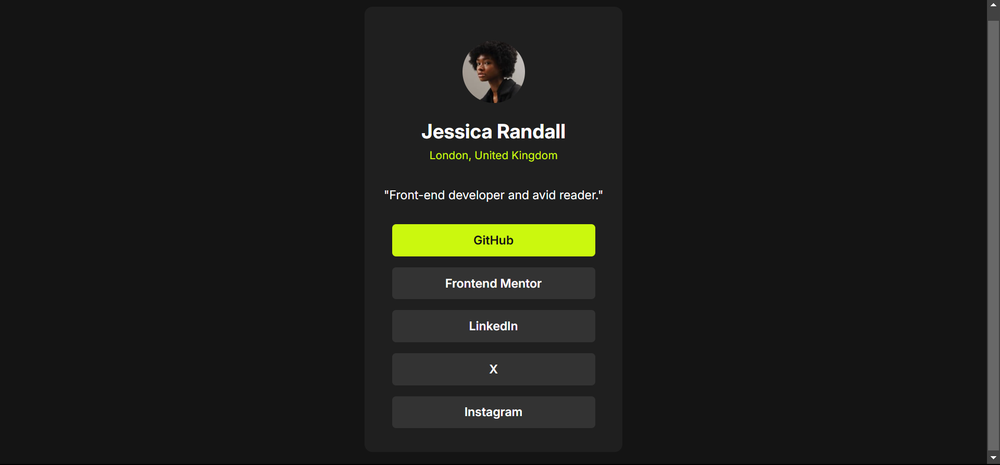

# Frontend Mentor - Social links profile solution

This is a solution to the [Social links profile challenge on Frontend Mentor](https://www.frontendmentor.io/challenges/social-links-profile-UG32l9m6dQ). Frontend Mentor challenges help you improve your coding skills by building realistic projects. 

## Table of contents

- [Overview](#overview)
  - [The challenge](#the-challenge)
  - [Screenshot](#screenshot)
  - [Links](#links)
- [My process](#my-process)
  - [Built with](#built-with)
  - [Continued development](#continued-development)
- [Author](#author)

## Overview

### The challenge

Users should be able to:

- See hover and focus states for all interactive elements on the page

### Screenshot



### Links

- [Solution URL](https://www.frontendmentor.io/solutions/react-social-links-profile-CXoX0N7WJ7)
- [Live site URL](https://socialprofilefrontend.netlify.app/)

## My process

I chose this simple project so I could practice React. 

In the terminal I ran the command `npm create vite@latest` and followed the instructions.

I created a folder named `components`, this is where I'll be putting all of my components for this project, like `HomeSocials.jsx`, `Header.jsx` and `Social.jsx`.

For the social media accounts, I decided to try something I did on a previous project, I created a component named `Social.jsx` to which I'd pass "props" (`children`) as its content from the `HomeSocials.jsx` component. It will make sense once you review the code:
- `Social.jsx`:
```jsx
const Social = ({children}) => {
  return (
    <div>
      {children}
    </div>
  )
}
export default Social
```
- `HomeSocials.jsx`:
```jsx
import Social from "./Social"

const HomeSocials = () => {
  return (
    <div className="social-container">
      <Social>
        <p>GitHub</p>
      </Social>
      <Social>
        <p>Frontend Mentor</p>
      </Social>
      <Social>
        <p>LinkedIn</p>
      </Social>
      <Social>
        <p>X</p>
      </Social>
      <Social>
        <p>Instagram</p>
      </Social>
    </div>
  )
}
export default HomeSocials
```
It might look not very practical at first, but in fact, it is practical when working with larger projects, it'd help maintaining an organized structure.

Since I'm using `react` and `vite` for this project, I ran the command `npm run build` which created the `dist` folder containing the optimized files for deployment.
### Built with

- Semantic HTML5 markup
- CSS custom properties
- Flexbox
- Mobile-first workflow
- React framework

### Continued development

This project was intentionally chosen for its simplicity, allowing me to focus on building my proficiency with React. For future projects, I plan to continue utilizing React and aim to integrate tailwind.css to enhance my front-end development skills.

## Author

- GitHub - [@ziad-rima](https://github.com/ziad-rima)
- Frontend Mentor - [@ziad-rima](https://www.frontendmentor.io/profile/ziad-rima)
- X - [@rima4082](https://x.com/rima4082)

